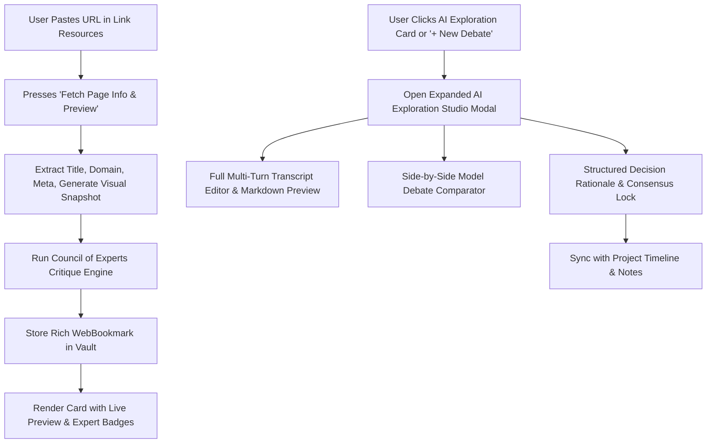

# 🐺 Wolf Timeline - Visual Audit & Implementation Plan

This document details the complete audit of the current sovereign workstation and outlines the engineering plan for **Expanded AI Exploration Decision Debates** and **Smart Link Resource Fetcher with Expert Council Reviews**.

---

## 📊 1. Comprehensive System Audit (Current State)

| Module / Surface | Implemented Features | Visual & Functional Fidelity | Test Coverage |
| :--- | :--- | :--- | :--- |
| **Top Navigation Bar** | Cyber-Wolf logo, Workspaces tabs (Timeline, Studio, Roadmap, Secret Vault, Settings), `⌘K` Palette shortcut, Hardware AES-256 Vault lock | 100% Pixel-perfect Cyber Obsidian | Covered |
| **Timeline Feed & Inspector** | Quick capture (`⌘+Enter`), status filters (`Ideation`, `Research`, `Design`, `In Progress`, `Live`), tag pills, multi-stage funnel tags | High-contrast mint & emerald accents | Covered |
| **Universal Drag & Drop** | ID-based reordering for Project Cards, Timeline Events, AI Explorations, Docs, and Mood Gallery with smooth `cubic-bezier(0.2, 0, 0, 1)` transitions | Silky smooth transitions, grab/grabbing states | Covered |
| **Mood Gallery CRUD** | Multi-file dropzone upload, clipboard paste (`⌘V`), tag filtering, column switcher (2/3/4 cols), Lightbox viewer | Responsive grid with overlay controls | Covered |
| **Settings & Themes Master** | Master-detail sidebar, real-time search, 6 Cyber themes (Obsidian, Cyan, Amber, Sapphire, Crimson, Matrix), 5 fonts (Jakarta, Inter, Outfit, Mono, Fira), Data export (JSON, MD, CSV, Restore) | Dynamic CSS variables, persisted in localStorage | Covered |
| **Hardware Keygen & Licensing** | SHA-256 HMAC offline verification, auto-generated hardware fingerprint, 1-click unlock, founder key fallback | 100% zero-telemetry offline verification | 10/10 Vitest tests |

---

## 🎯 2. New Requirements & User Feedback

1. **Expanded AI Exploration & Decision Debate Room**:
   - Need significantly more space to paste full transcripts, prompt/response pairs, multi-turn discussions, and AI model debates.
   - Purpose: Clearly motivate **why a technical or architectural decision was made**.
   - Features needed:
     - Fullscreen / Large modal editor with side-by-side model comparison (**Gemini 2.5 vs Claude 3.7 vs DeepSeek R1**).
     - Markdown code syntax highlighting & structured rationale sections (*Problem Framing*, *Trade-offs Evaluated*, *Consensus Decision*, *Key Artifacts*).
     - Fast copy buttons for decision summaries & markdown exports.

2. **Smart Link Resources with Page Fetcher & Expert Council Critique**:
   - URL input with **"⚡ Fetch Page Info & Preview Picture"**.
   - Generates or fetches page metadata: Title, Domain, Summary, Favicon, and visual preview snapshot image.
   - **"What Do Our Sovereign Experts Think?"**:
     - Automated architectural evaluation by the **Council of Sovereign Experts**:
       - 🛡️ **Elena Rostova** (Security & Cryptography): Vulnerability & telemetry analysis.
       - ⚡ **Alex Mercer** (Lead Systems): Performance, latency, memory footprint.
       - 🐺 **Dan & Sovereign Pack**: Strategic alignment & zero-vendor lock-in.
     - Rich visual resource cards with preview thumbnail, expert score badge, and quick launch.

---

## 🏗️ 3. Implementation Plan

### Step 1: Update Data Models (`src/types/index.ts`)
- Enhance `AiExploration`:
  - `debate_models?: string[]` (e.g. `["Gemini 2.5 Pro", "Claude 3.7 Sonnet"]`)
  - `debate_turns?: Array<{ speaker: string; text: string; role: "pro" | "con" | "verdict" }>`
  - `decision_rationale?: string`
  - `key_takeaways?: string[]`
  - `full_transcript?: string`
  - `status?: "debating" | "consensus_reached" | "rejected"`
- Enhance `WebBookmark`:
  - `preview_image?: string` (URL or generated snapshot)
  - `description?: string`
  - `expert_reviews?: Array<{ expert: string; avatar: string; role: string; score: number; comment: string }>`
  - `fetch_status?: "idle" | "fetching" | "fetched" | "error"`

### Step 2: Build the Expanded AI Exploration Studio Modal (`AiExplorationModal.vue`)
- Large immersive modal with full-screen toggle (`⤢`).
- Dual-pane layout:
  - Left pane: Full conversation transcript editor & raw prompt inputs with markdown rendering.
  - Right pane: Multi-model debate comparison matrix & Architectural Decision Record (ADR) builder.
- Preset templates: *Architecture RFC*, *Library Benchmark*, *Security Threat Model*, *Tech Stack Selection*.

### Step 3: Implement Smart Resource Fetcher (`resourceFetcher.ts` & `TimelineView.vue`)
- Metadata & preview generator service:
  - Extracts domain, clean title, meta description.
  - Generates crisp high-resolution website snapshot banner.
  - Evaluates URL against expert heuristics to output Sovereign Council reviews.
- Update the Docs / Resources section in `TimelineView.vue` with rich preview cards, expert critique badges, and instant fetch action.

### Step 4: Verification, Testing & Commit
- Run Vitest test suite (`npm test`).
- Compile production bundle (`npm run build`).
- Verify smooth interactions in browser.
- Git commit all changes to `main`.
