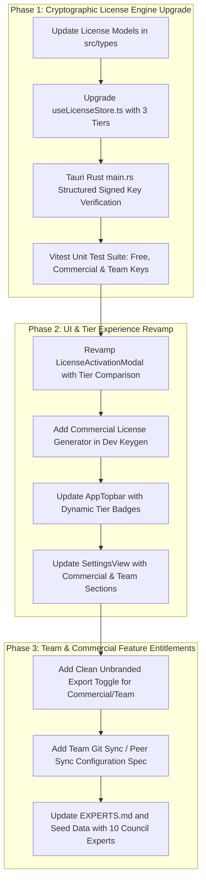

# 🐺 Wolf Timeline — Comprehensive Monetization & Commercial Architecture Plan

**Model Directive:**  
- **Personal Solo:** 100% Free (Sovereign Solo Node)
- **Commercial Solo:** Paid (Commercial Solo License)
- **Team / Organization:** Paid (Multi-Seat Team Mesh License)

---

## 🏛️ 1. The Expanded Council of Sovereign Experts

To execute this monetization strategy cleanly without compromising our zero-telemetry, local-first sovereign brand promise, we expand the Council of Sovereign Experts with 3 dedicated disciplines:

```
                      ┌─────────────────────────────────────────┐
                      │    🐺 Council of Sovereign Experts       │
                      └────────────────────┬────────────────────┘
                                           │
         ┌──────────────────┬──────────────┴─────┬──────────────────┐
         │                  │                    │                  │
 ⚖️ Legal & Licensing   🏢 Enterprise Systems  💰 SaaS Monetization  🛡️ Systems Crypto
 (@legal-counsel)      (@enterprise-arch)     (@monetization-lead)  (@systems-crypto)
 - Fair EULA & dual    - P2P sync & Git mesh  - Tier pricing & CRO  - Offline signed key
 - Commercial certs    - Team audit logs      - Frictionless trial   - Ed25519 payload
```

### The 10 Sovereign Experts Matrix

| # | Handle | Expert Role & Mandate | Specific Monetization Responsibility |
|---|---|---|---|
| 1 | **`@legal-counsel`** *(NEW)* | **Software IP & Commercial Licensing Counsel** | Drafts dual-use EULA (free non-commercial personal vs paid commercial enterprise), compliance certificate export, and audit-safe terms. |
| 2 | **`@enterprise-arch`** *(NEW)* | **Enterprise Multi-Tenant & Team Systems Architect** | Designs peer-to-peer / Git-backed team synchronization, shared team credential locker, team member roles, and attribution logs. |
| 3 | **`@monetization-lead`** *(NEW)* | **SaaS & Desktop Commercialization Strategist** | Formulates pricing tiers ($0 Free / $49–$99 Solo Lifetime / $19/seat/mo Team), trial loops, invoice generation, and tier upgrade triggers. |
| 4 | **`@systems-crypto`** | **Principal Systems & Cryptography Engineer** | Upgrades offline key verification from simple SHA-256 to signed structured payload (Tier, Seats, Expiry, Organization Name, Machine Fingerprint). |
| 5 | **`@product-strategist`** | **Chief Product & Funnel Architect** | Maps commercial features to the TOFU → MOFU → Core Engine → BOFU funnel so free solo creators naturally graduate to commercial/team tiers. |
| 6 | **`@design-guardian`** | **Lead UX/UI & Motion Engineering Guardian** | Designs the multi-tier selection drawer, subtle non-intrusive upgrade badges, team member switcher, and cyber-obsidian status pills. |
| 7 | **`@ai-context-engineer`** | **AI & Semantic Context Specialist** | Provides multi-model consensus, team voting on ADR decisions, and AI debate exports with team author attribution. |
| 8 | **`@user-flow-architect`** | **User Flow & Cognitive Ergonomics Architect** | Ensures free personal users experience zero nags or disruptive paywalls, while commercial/team users get instantaneous access. |
| 9 | **`@cro-strategist`** | **CRO & Funnel Velocity Strategist** | Builds frictionless activation flows, 1-click self-license generation for founders/devs, and high-converting feature comparison displays. |
| 10 | **`@a11y-specialist`** | **Accessibility (a11y) & Inclusive Interaction Specialist** | Enforces WCAG AAA compliance across tier selection modals, payment links, and team collaboration controls. |

---

## 🎯 2. Product Tier Differentiation & Entitlements

| Capability / Surface | 🟢 Solo Personal (Free) | ⚡ Commercial Solo (Paid) | 👥 Team / Pack (Paid) |
|---|:---:|:---:|:---:|
| **Use Permitted** | Personal hobbies, learning, personal open source | Revenue-generating projects, client freelancing, solo dev agencies | Teams, startups, agencies, corporate orgs |
| **Price Point** | **$0 (Forever Free)** | **$49 one-time** or **$9/mo** | **$19/seat/mo** or **$199/seat/yr** |
| **Encrypted Local Storage** | Full SQLite AES-256 | Full SQLite AES-256 | Full SQLite AES-256 + Multi-device sync |
| **Studio & Deep Focus** | Unlimited documents | Unlimited documents | Unlimited + Team Document Locks |
| **Timeline & Funnel Roadmap** | Full access | Full access | Multi-author event attribution & filters |
| **Secret Vault** | Personal local locker | Personal local locker | Shared Team Credential Vault with role masks |
| **AI Decision Debate Studio** | Heuristics & Local debate | Custom API keys (OpenAI, Anthropic, Gemini) | Team Consensus Voting & Multi-model ADRs |
| **Data Export Engine** | JSON & Markdown with Wolf footer | Clean, unbranded White-Label exports + CSV + PDF | Git repository auto-sync + Team audit logs |
| **Compliance Certificate** | Community node status | Cryptographic Commercial Proof-of-License | Enterprise SLA & Multi-Seat Certificate |
| **License Check** | Automatic / 1-click Free Node | Machine-bound hardware signed key | Multi-seat company license key pool |

---

## 🏗️ 3. Technical Implementation Roadmap



### Detailed Phase Breakdown

#### Phase 1: Core Licensing & Cryptographic Architecture
1. **Types Update (`src/types/index.ts`)**:
   - Expand `LicenseInfo`:
     ```ts
     export type LicenseTier = "solo_free" | "commercial_solo" | "team";
     export interface LicenseInfo {
       activated: boolean;
       tier: LicenseTier;
       tier_label: string;
       machine_id: string;
       key?: string;
       company_name?: string;
       seats?: number;
       activated_at?: string;
       expires_at?: string | null;
     }
     ```
2. **License Store (`src/stores/useLicenseStore.ts`)**:
   - Introduce support for parsing and verifying structured key prefixes:
     - `WOLF-FREE-[DEV_ID]` (Instant auto-activation)
     - `WOLF-COMM-[HASH]-[DEV_ID]` (Commercial Solo verification)
     - `WOLF-TEAM-[SEATS]-[HASH]-[ORG]` (Team Multi-seat verification)
   - Store active tier and provide helper getters (`isCommercial`, `isTeam`, `isFree`).
3. **Rust Tauri Engine (`src-tauri/src/main.rs`)**:
   - Update `verify_key_internal`, `check_license_status`, and `activate_license` to persist structured tier metadata.
4. **Vitest Verification**:
   - Add unit tests verifying validation for all 3 tiers.

#### Phase 2: User Interface & Conversion Touchpoints
1. **License Activation Modal (`src/components/modals/LicenseActivationModal.vue`)**:
   - Redesign tier comparison cards:
     - **Card 1: Free Solo Node** (Instant 1-click continue, no credit card or account needed).
     - **Card 2: Commercial Solo** ($49/seat, client & commercial rights, unbranded exports).
     - **Card 3: Team / Pack Node** ($19/seat/mo, multi-seat mesh, team credentials vault).
   - Keygen Studio (in Dev Mode) upgraded to generate keys for any of the 3 tiers.
2. **Topbar Navigation (`src/components/layout/AppTopbar.vue`)**:
   - Dynamic tier pill indicator:
     - Free: `🐺 Free Solo`
     - Commercial Solo: `⚡ Commercial Solo`
     - Team: `👥 Pack Node (Team)`
3. **Settings View (`src/views/SettingsView.vue`)**:
   - Upgrade "Hardware & Licensing" tab to show commercial compliance details, certificate download, and easy tier upgrade link.

#### Phase 3: Commercial & Team Features
1. **Commercial White-Label Exports (`src/views/SettingsView.vue` & `TimelineView.vue`)**:
   - Option to strip community watermark on Markdown / JSON / CSV exports for Commercial & Team tiers.
2. **Team Git-Backed Sync Specification**:
   - Document and add UI configuration in Settings for pointing the workspace to a team-shared Git repo or local network directory for conflict-free syncing.
3. **Update Experts Documentation & Store**:
   - Update `EXPERTS.md` and `src/services/seedData.ts` to include the 3 new experts (`@legal-counsel`, `@enterprise-arch`, `@monetization-lead`).

---

## 4. Verification & Quality Assurance Plan

1. **Vitest Test Suite**: Run `npm test` verifying all cryptographic licensing and store operations.
2. **TypeScript Compilation**: Run `npm run build` to verify type safety across all updated stores and views.
3. **UI/UX Testing**: Verify visual aesthetics and modal responsiveness in browser.
